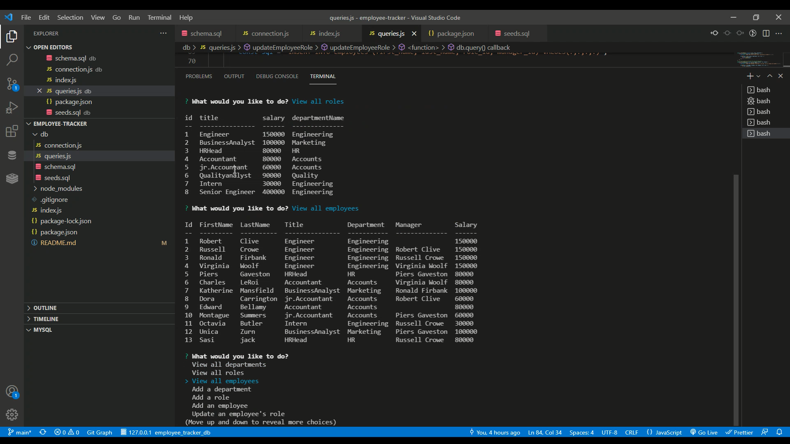

# Employee-Tracker

<br />
A command line application that helps to manage and keep track on various Departments, Roles and Employees data within an organization. User can view all departments and all roles related to the departments. All employees details with their Name, Role , Salary, Title, Manager's name (if the employee have a manager) and department name. User can add
department, role and employee. User can also update employee's role.

## Table of Contents:

- [Installation](#installation)
- [Usage](#usage)
- [License](#license)
- [Contributing](#contributing)
- [Tests](#tests)
- [Questions](#questions)

### Installation:

1. NPM
2. Mysql2

### Usage:
```
node index.js
```

### Demo

[](./assets/images/EmployeeTracker-Demo.mp4)

### License:

[](https://opensource.org/licenses/ISC)

### Questions:

If you have any questions email me or reach out on:

- Varsha Jain - csvarshajain@gmail.com
- [Github](https://github.com/vjain83)
